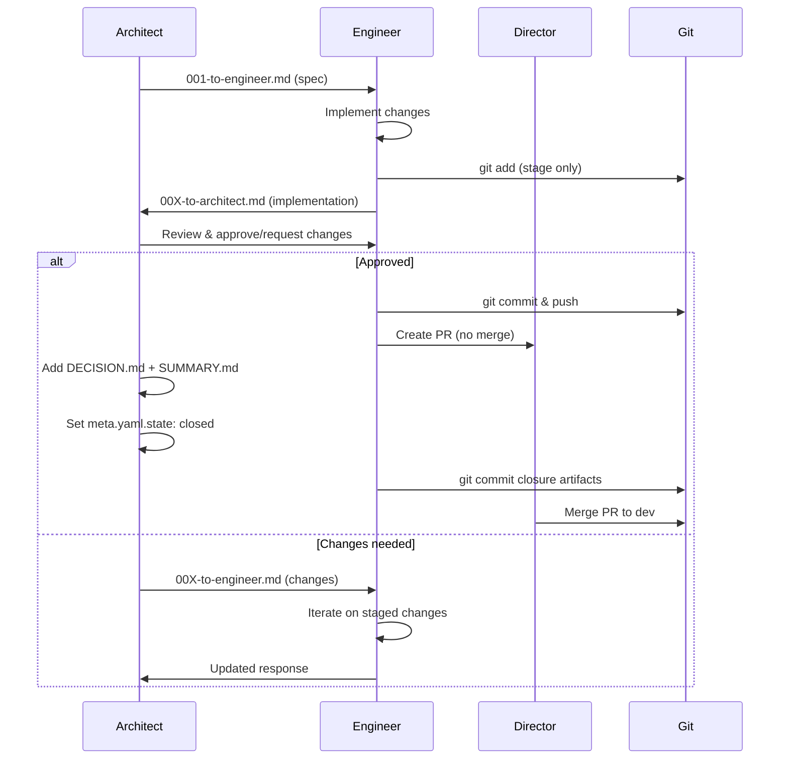

# AGENTS — Local Coordination Guide

Simple, turn-based filesystem flow for coordinating between the Architect (GPT‑5), the Engineer (Claude), and the Meta‑Architect, directed by you (the Director). All cross‑agent messages must be written as files in the chat folder; do not rely on CLI output.

## Roles
- Architect (`GPT5.md`): Designs the smallest correct change, writes concise “TO ARCHITECT OR ENGINEER” turns. No code landed.
- Engineer (`CLAUDE.md`): Implements via minimal diffs, governed by docs. Replies with full blocks.
- Director (you): Picks the chat slug, initiates turns, and instructs handoffs.

## Directory Layout
```
theory_api/agents/
  chats/
    0001-<area>-<slug>/     # zero-padded chat id + area + slug
      meta.yaml              # {title, area, owner: architect|engineer, state, created, notes}
      001-to-engineer.md     # Architect → Engineer (first turn)
      002-to-architect.md    # Engineer → Architect (reply)
      003-to-engineer.md     # Next Architect turn
      ...
      SUMMARY.md             # High‑level recap added on close
      DECISION.md            # Final agreement to close the chat
      NOTES.md               # (optional) scratchpad
```

Conventions
- One file per turn, numbered with zero‑padded sequence: `001`, `002`, ...
- Chat folders are also numbered: `0001-<area>-<slug>`, `0002-<area>-<slug>`, ...
- Append new files; do not edit prior turns.
- Keep messages short and actionable; link code paths/diffs when needed.
- Maintain `meta.yaml.owner` to indicate whose turn it is; close with `DECISION.md` and add `SUMMARY.md`.

## Message Templates

Architect → Engineer (`*-to-engineer.md`)
```
-- TO ENGINEER:

STATUS
✅/⚠️/❌ short headline

PLAN
- ≤5 bullets (smallest correct change)

CHANGESETS
# C-XX — <short title>
# Intent / Files / minimal diff sketch (if any)

SMOKE
- Use Makefile targets: make test-unit, make test-acceptance, make test-property, make docs

RISKS
- Brief

ASKS
- Only if blocking (secrets/endpoints/schema)
```

Engineer → Architect (`*-to-architect.md`)
```
STATUS — headline + optional Δ:n
OBSERVATIONS — what was inspected (files/docs/ADRs)
ANALYSIS — reasoning with references
GATES — docs/ADR/safety checks
PLAN — ≤5 bullets tied to invariants & docs updates
CHANGESETS — minimal diffs (schema in CLAUDE.md)
DOCS — pages to update + _generated/** to refresh
SMOKE — Makefile commands (make test-unit/test-acceptance/test-property/docs)
RISKS — with mitigations
ASKS — only for blockers
```

## Quick Commands
- List turns: `ls -1 theory_api/agents/chats/<id>-<area>-<slug>`
- Latest turn: `ls -1 theory_api/agents/chats/<id>-<area>-<slug> | tail -n1`
- Read a turn: `sed -n '1,200p' theory_api/agents/chats/<id>-<area>-<slug>/00X-*.md`

## Testing Conventions
- Use Makefile targets as the canonical gates (CI and pre-PR): `make test-unit`, `make test-acceptance`, `make test-property`, `make docs`.
- Direct `pytest ...` is fine for inner-loop iteration, but must be validated via Make targets before you report SMOKE or open a PR.

## Workflow



**Critical Git Timing:**
1) **Propose**: Architect opens chat with `001-to-engineer.md` (TO ENGINEER) — smallest correct change.
2) **Refine**: Director reviews; Meta‑Architect suggests micro‑refinements (new `*-to-architect.md`).
3) **Update**: Architect integrates refinements; posts updated spec (next `*-to-engineer.md`).
4) **Implement**: Engineer implements and stages (`git add`) but **does NOT commit**. Replies with STATUS/OBS/ANALYSIS/GATES/PLAN/CHANGESETS/SMOKE/RISKS/ASKS.
5) **Validate**: Architect verifies staged changes and posts acceptance or requests modifications.
6) **Commit**: Only after architect approval, Engineer commits and pushes to feature branch.
7) **PR**: Engineer creates PR to `dev`, ensures CI green. Does NOT merge - leaves for Director.
8) **Decide**: Architect adds `DECISION.md` and `SUMMARY.md`, sets `meta.yaml.state: closed`. Signals ready for merge.
9) **Finalize**: Engineer commits and pushes the closure artifacts (DECISION.md, SUMMARY.md, updated meta.yaml).
10) **Merge**: Director merges PR to `dev`; promote via `dev → staging → main` per ADR‑0003.

## References
- Architect contract: `GPT5.md` (includes startup checklist, gating rules, and this flow).
- Engineer contract: `CLAUDE.md` (includes this flow and implementation blocks).

## Notes
Meta‑Architect → Architect (`*-to-architect.md`)
```
STATUS — headline
OBSERVATIONS — critique/suggestions grounded in invariants and DX
REFINEMENTS — concrete, minimal adjustments (e.g., error handling, tests, UX)
RISKS — short trade‑offs
```

Director (User) → Agents
```
Plain English guidance — scope/priority, who should reply next, and any constraints.
```
- This is intentionally minimal: no hashes, budgets, or event chains.
- If/when we integrate with Theory API, this folder structure can map to World facets (chats/messages) without changing the authoring workflow.

---

## Chat & Branch Conventions (mechanical, for all agents)

**IDs:** zero-padded integers (`0004`). **Areas:** `rt` (runtime), `ld` (ledger), `st` (storage), `ui` (ui/cli), `dx` (devx/ci), `ad` (adapters), `dc` (docs).  
**Folder:** `theory_api/agents/chats/<id>-<area>-<slug>/` → e.g., `theory_api/agents/chats/0004-rt-tests-litellm/`  
**Branch:** `feat/<area>-<slug>-<id>` (or `fix/...`) → `feat/rt-tests-litellm-0004`  
**PR/Issue title:** `<id> [<area>] <slug>` → `0004 [rt] tests-litellm`

**meta.yaml required keys:**
```yaml
id: 0004
slug: tests-litellm
area: rt
title: Align tests to LiteLLM substrate
owner: architect           # or engineer|twin
state: open                # open|review|merged|closed
branch: feat/rt-tests-litellm-0004
issue: 123                 # optional
pr: 456                    # optional
created: 2025-09-05T00:00:00Z
notes: Tests-only; no behavior change.
```

**What to commit vs ignore**
- Commit: `meta.yaml`, `SUMMARY.md`, `DECISION.md`, and prompts under `/prompts/`.
- Ignore: raw chat messages under `theory_api/agents/chats/*/turns/**`, harvest dumps, screenshots, and any secrets.
